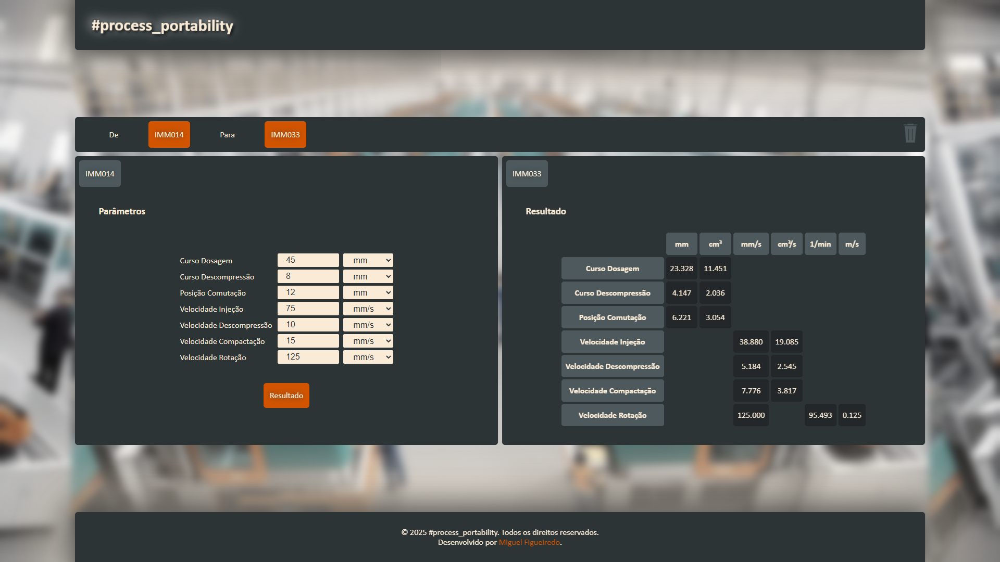

# #process_portability

É uma aplicação web que ajuda na portabilidade de processos entre diferentes máquinas, no sector da moldação por injeção de plásticos.

Esta aplicação permite a conversão de velocidades, cursos e posições, assim como a rotação do fuso, de forma a obter o comportamento do plástico dentro do molde o mais semelhante possível.

Em teoria, a velocidade de injeção deve ser semelhante em ambas as máquinas, tal como o volume injetado na fase de enchimento da peça moldada. Como output a duração desta fase deve ser idêntica (tempo de injeção).

Relativamente, à rotação do fuso podemos perceber que ao utilizar uma unidade de velocidade angular(ex: RPM) em fusos cujo diâmetro seja diferente, obtemos uma velocidade periferica, igualmente, diferente. Deste modo, podemos concluir que o ideal é portar a rotação através de unidades de velocidade linear, tais como <b>mm/s</b> ou <b>m/s</b>.

## Pre-visualização

## Podes testar aqui:
<a href="https://mfigueiredoo.github.io/process_portability/">#process_portability</a>
